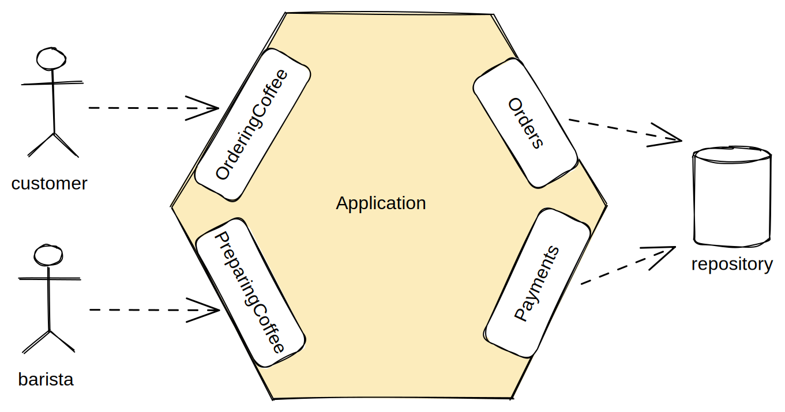

[](https://github.com/victorcosta555/clean-architecture-example)
[](https://github.com/victorcosta555/clean-architecture-example/blob/master/README.pt-br.md)

# Clean Architecture Example - Coffee Shop

<div align="justify"> This application exemplifies the implementation of a hexagonal architecture using Spring Boot and Java 17. Hexagonal 
architecture is a popular pattern for separating business logic from infrastructure, enabling flexibility in technology 
choices and facilitating isolated testing of business logic.
</div>

## Features

- Customers can place coffee pedidos with various specifications, such as type, milk preference, tamanhoBebida, and whether it's for in-store or takeaway.
- Customers can add additional items to their pedido before pagamento.
- Orders can be cancelled by customers before pagamento.
- Orders become immutable once paid.
- Customers can pay for pedidos using a credit card.
- Upon pagamento, customers receive a recibo.
- Baristas can start preparing pedidos once they are paid.
- Baristas can mark pedidos as ready once preparation is complete.
- Customers can retrieve their pedidos once they are marked as ready.

## Usage

To create an pedido, send a POST request to `http://your_address:your_port/api/v1/pedido`.

```json
{
    "localConsumoPedido": "IN_STORE",
    "items": [
        {
            "drink": "LATTE",
            "quantity": 1,
            "milk": "WHOLE",
            "tamanhoBebida": "LARGE"
        }
    ]
}
```

To pay for an pedido, send a POST request to `http://your_address:your_port/api/v1/pagamento/{id}`, where `{id}` is the pedido ID.

```json
{
    "cardHolderName": "Michael Faraday",
    "cardNumber": "11223344",
    "expiryMonth": 12,
    "expiryYear": 2023
}
```


## Architecture Overview

<div align="justify"> This application adopts the hexagonal architecture, emphasizing the separation of business logic from infrastructure. 
It identifies two primary actors: customers and baristas. Accordingly, it introduces two primary ports: OrderingCoffee 
and PreparingCoffee. Additionally, secondary ports for storing pedidos and pagamentos are introduced, named Orders and 
Payments, respectively. These secondary ports handle storage and retrieval operations for pedidos and pagamentos.
</div>

<br/>



## Transaction Handling

<div align="justify"> Use cases represent natural units of work in the application. To ensure consistency, each use case is wrapped in a 
transaction. Instead of directly annotating use case methods with @Transactional, aspect-oriented programming (AOP) is 
employed to add transactional behavior without altering the core code. While not covered in detail here, AOP enables the 
addition of cross-cutting concerns to the application without modifying the primary logic.
</div>

<br/>

```java
public class TransactionalUseCaseExecutor {
    @Transactional
    <T> T executeInTransaction(Supplier<T> execution) {
        return execution.get();
    }
}
```

<div align="justify"> Basically, the code finds any classes annotated with @UseCase and applies the TransactionalUseCaseAspect to the methods 
in that class. This brings another useful quality to the @UseCase annotation that was created.
</div>

<br/>

```java
@Aspect
@RequiredArgsConstructor
public class TransactionalUseCaseAspect {

    private final TransactionalUseCaseExecutor transactionalUseCaseExecutor;

    @Pointcut("@within(useCase)")
    void inUseCase(UseCase useCase) {

    }
  
    @Around("inUseCase(useCase)")
    Object useCase(ProceedingJoinPoint proceedingJoinPoint, UseCase useCase) {
        return transactionalUseCaseExecutor.executeInTransaction(() -> proceed(proceedingJoinPoint));
    }

    @SneakyThrows
    Object proceed(ProceedingJointPoint proceedingJoinPoint) {
        return proceedingJointPoint.proceed();
    }
}
```

## How to Run the Application

To run the application locally, you'll need Java 17, Maven.

Follow these steps:

1. Clone the Repository:
   2. Clone the repository to your local machine using Git:

```bash
git clone git@github.com:victorcosta555/clean-architecture-example.git
```
2. Navigate to the Project Directory:

```bash
cd your-project-directory
```
3. Build the Project:
   4. Use Maven to build the project:

```bash
mvn clean install
```

4. Run the Application:
   5. Execute the Spring Boot application using the Maven Spring Boot plugin:

```bash
mvn spring-boot:run
```

5. H2 Database Console:
   6. You can access the H2 database console to view and manage the database by going to the following URL:

```bash
http://localhost:8080/h2-console
```

- DBC URL: jdbc:h2:mem:testdb
- Username: sa
- Password: (leave it blank)
