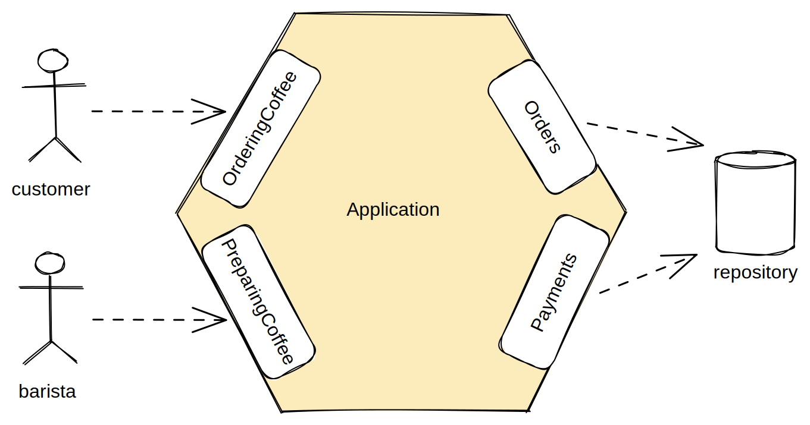

# Clean Architecture Example - Cafeteria App

<div align="justify"> Esta aplicação exemplifica a implementação de uma arquitetura hexagonal utilizando Spring Boot e Java 17. A arquitetura 
hexagonal é um padrão popular para separar a lógica de negócios da infraestrutura, permitindo flexibilidade nas escolhas 
de tecnologia e facilitando testes isolados da lógica de negócios.
</div>

## Requisitos 

- Os clientes podem fazer pedidos de café com várias especificações, como tipo, preferência de leite, tamanho e se é para consumo no local ou para viagem.
- Os clientes podem adicionar itens adicionais ao seu pedido antes do pagamento.
- Os pedidos podem ser cancelados pelos clientes antes do pagamento.
- Os pedidos se tornam imutáveis uma vez pagos.
- Os clientes podem pagar pelos pedidos usando um cartão de crédito.
- Após o pagamento, os clientes recebem um recibo.
- Os baristas podem começar a preparar os pedidos assim que eles forem pagos.
- Os baristas podem marcar os pedidos como prontos assim que a preparação estiver completa.
- Os clientes podem retirar seus pedidos assim que forem marcados como prontos.

## Usando a Aplicacao

Para criar um pedido envie uma requisicao POST para `/api/v1/order`

```json
{
    "location": "IN_STORE",
    "items": [
        {
            "drink": "LATTE",
            "quantity": 1,
            "milk": "WHOLE",
            "size": "LARGE"
        }
    ]
}
```

Para pagar um pedido sendo uma requisicao POST para `/api/v1/payment/{id}` onde `{id}` igual o ID do pedido

```json
{
    "cardHolderName": "Michael Faraday",
    "cardNumber": "11223344",
    "expiryMonth": 12,
    "expiryYear": 2023
}
```

## Resumo da Arquitetura

<div align="justify">Esta aplicação adota a arquitetura hexagonal, enfatizando a separação da lógica de negócios da infraestrutura. Identifica
dois atores principais: clientes e baristas. Assim, introduz dois portos principais: OrderingCoffee (Fazer Pedido de Café) 
e PreparingCoffee (Preparar Café). Adicionalmente, são introduzidos portos secundários para armazenar pedidos e pagamentos, 
denominados Orders (Pedidos) e Payments (Pagamentos), respectivamente. Esses portos secundários lidam com operações de 
armazenamento e recuperação de pedidos e pagamentos.
</div>

<br/>



## Funcionamento de uma Transaçāo

<div align="justify"> Os casos de uso representam unidades naturais de trabalho na aplicação. Para garantir consistência, cada caso de uso é 
envolvido em uma transação. Em vez de anotar diretamente os métodos dos casos de uso com @Transactional, a programação 
orientada a aspectos (AOP) é utilizada para adicionar comportamento transacional sem alterar o código principal. Embora 
não abordado em detalhes aqui, AOP permite a adição de preocupações transversais à aplicação sem modificar a lógica principal.
</div>

<br/>

```java
public class TransactionalUseCaseExecutor {
    @Transactional
    <T> T executeInTransaction(Supplier<T> execution) {
        return execution.get();
    }
}
```


<div align="justify"> Basicamente, o código encontra todas as classes anotadas com @UseCase e aplica o TransactionalUseCaseAspect aos métodos 
dessa classe. Isso adiciona mais uma qualidade útil à anotação @UseCase que foi criada.
</div>

<br/>

```java
@Aspect
@RequiredArgsConstructor
public class TransactionalUseCaseAspect {

    private final TransactionalUseCaseExecutor transactionalUseCaseExecutor;

    @Pointcut("@within(useCase)")
    void inUseCase(UseCase useCase) {

    }
  
    @Around("inUseCase(useCase)")
    Object useCase(ProceedingJoinPoint proceedingJoinPoint, UseCase useCase) {
        return transactionalUseCaseExecutor.executeInTransaction(() -> proceed(proceedingJoinPoint));
    }

    @SneakyThrows
    Object proceed(ProceedingJointPoint proceedingJoinPoint) {
        return proceedingJointPoint.proceed();
    }
}
```

## Cono iniciar a aplicaçāo

Para iniciar a aplicaçāo localmente você irá precisar de ter Java 17 e Maven.

Siga estes passos:

1. Clone o repositorio:
   2. Clone o repositorio para o seu computador usando o seguinte comando git:

```bash
git clone git@github.com:victorcosta555/clean-architecture-example.git
```

2. Navegue ate o local onde o projeto foi clonado 

```bash
cd your-project-directory
```

3. Construa o projeto usando o seguinte comando Maven:

```bash
mvn clean install
```

4. Execute a aplicacāo

```bash
mvn spring-boot:run
```

5. H2-console 
   6. E possivel acessar o console do H2 para acessando o endereço:

```bash
http://localhost:8080/h2-console
```

- DBC URL: jdbc:h2:mem:testdb
- Username: sa
- Password: (leave it blank)